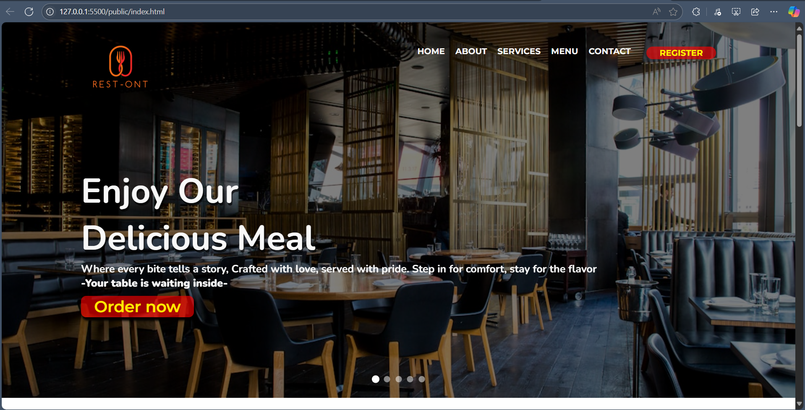
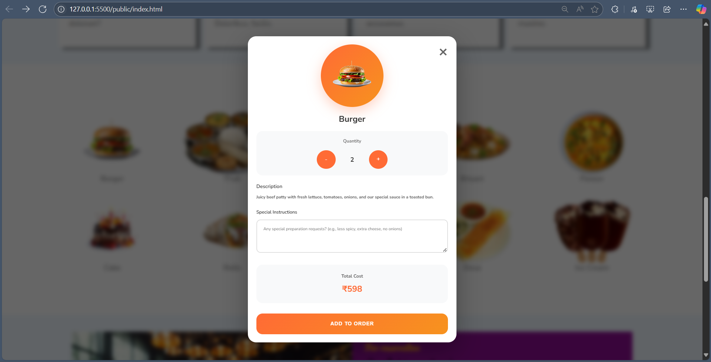
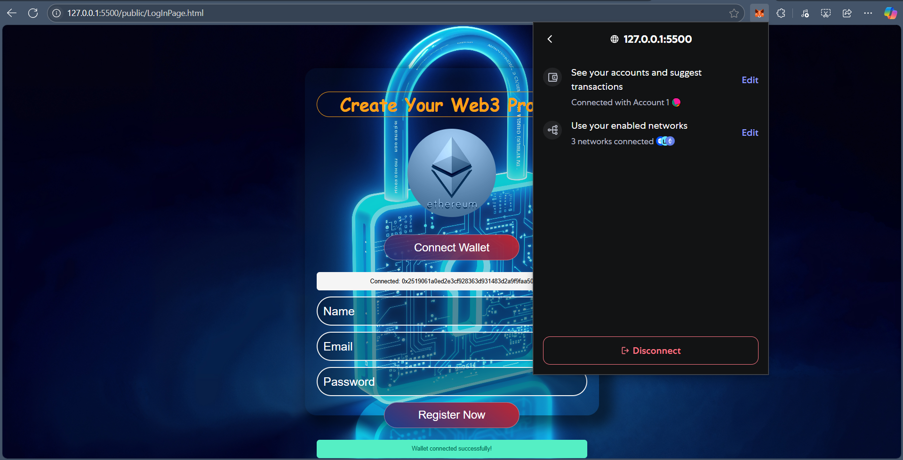

# 🍽️ Restaurant Web3 Auth Website

This is a modern, responsive restaurant website that allows users to:

- Browse a menu
- Order food
- Authenticate and interact using **Web3 / MetaMask**

> Built using HTML, CSS, JavaScript, and MetaMask Ethereum Wallet Integration.

---

## 🔐 Web3 Authentication with MetaMask

This project implements **Web3 login** using the MetaMask browser extension.  
It enables users to connect their Ethereum wallet before placing an order.

### How it works:

- Detects if MetaMask is installed
- Allows the user to connect their wallet
- Authenticates the user's public address
- (Optional) You can extend it to save orders linked to the wallet address in a backend or smart contract

---

## 🧩 Features

- 🍕 Interactive menu to order food
- 📱 Mobile-first responsive design
- 🔐 Connect wallet using MetaMask (Web3.js / Ethereum API)
- ✅ Real-time wallet connection check
- 🎨 Clean user interface with custom CSS
- ⚠️ Graceful fallback if MetaMask is not installed

---

## 📸 Screenshots

### Homepage  


### Order Menu 


### Connect Wallet Button  



---

## 🛠️ Tech Stack

| Tech        | Description                        |
|-------------|------------------------------------|
| HTML / CSS  | Frontend layout and styling        |
| JavaScript  | DOM interaction & Web3 integration |
| MetaMask    | Ethereum wallet for Web3 auth      |
| GitHub Pages| Hosting the static website         |

---

## 🚀 Live Demo

👉 [Click to Visit Live Website](https://krayush12112.github.io/restaurant-web3-auth/)

---

## 🧪 How to Run Locally

You can run this project locally in your browser:

1. Clone the repo:
   ```bash
   git clone https://github.com/KrAyush12112/restaurant-web3-auth.git
   cd restaurant-web3-auth
